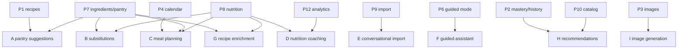

# Cooking — Future AI Opportunities

AI features build on the structured data established in Phases 1-9. Each opportunity below lists the value, the data it depends on, the phase it can start after, and the surface it integrates with. None are required for the core domain; they are the long-term payoff of doing the data modeling well.

> Architectural rule (carried from [`08-ocr-import-architecture.md`](08-ocr-import-architecture.md)): all model calls run server-side in Supabase Edge Functions. No API keys in the browser. AI suggestions are advisory; the user always confirms before anything is saved or scheduled.

## 1. Opportunity catalog

### A. Pantry-based recipe suggestions ("what can I make right now?")

- Value: surfaces recipes the user can cook now (or with 1-2 missing items), directly serving the cook-at-home goal.
- Depends on: P7 (ingredient normalization + pantry), P1 (recipes). Can be rule-based first (no LLM) using `RecipeAvailability`.
- AI upgrade: an LLM ranks/explains suggestions ("you can make X; swap Y for Z") using pantry + preferences.
- Surface: Cooking page "Make now" rail; Daily Focus item.
- Start after: P7.

### B. Smart ingredient substitutions

- Value: when an ingredient is missing or restricted (dietary flag), propose substitutions with quantity adjustments.
- Depends on: P7 (canonical ingredients/aliases), P8 (nutrition for impact), `cookingPreferences.dietaryFlags`.
- Surface: recipe detail + guided mode ("out of buttermilk? use milk + lemon").
- Start after: P7 (basic), P8 (nutrition-aware).

### C. Auto meal planning

- Value: generate a weekly plan from goals (budget, nutrition targets, variety, pantry), creating planned cooks on the calendar.
- Depends on: P4 (planned cooks/calendar), P7 (pantry), P8 (nutrition), `cookingPreferences`, cooking history (mastery + recent cooks for variety/repetition balance).
- Surface: a "Plan my week" action that drafts planned `cooking_sessions` for user review.
- Start after: P8.

### D. Nutrition coaching & insights

- Value: weekly nutrition trends from completed cooks; gentle nudges ("more protein this week", "you cooked at home 5/7 days").
- Depends on: P8 (per-serving nutrition), P2 (cooking sessions), P12 (weekly review section).
- Surface: Weekly Review cooking section; dashboard insight.
- Start after: P8 + P12.

### E. Conversational recipe import & cleanup

- Value: beyond extraction (P9), let the user refine an imported draft conversationally ("split step 3 into two", "convert to metric", "scale to 6 servings").
- Depends on: P9 (import pipeline), P7 (matching).
- Surface: Import Wizard review step.
- Start after: P9.

### F. Guided-mode assistant

- Value: in-the-moment help during a cook ("how do I know the pasta is done?", "set a 5 minute timer"), including voice.
- Depends on: P6 (guided mode + timer reducers — the assistant calls existing timer actions), recipe steps.
- Surface: GuidedCookingMode helper.
- Start after: P6.

### G. Recipe quality & enrichment

- Value: auto-suggest difficulty/experience level, cook time, equipment, and `cookingMethod` for retention; fill missing ingredient quantities.
- Depends on: P1 (recipes), P7 (matching), P8 (method→retention).
- Surface: recipe form assist + import.
- Start after: P7.

### H. Personalized recommendations & variety

- Value: recommend new recipes to try based on mastery patterns, categories cooked, and stated preferences; encourage breadth vs depth.
- Depends on: P2 (mastery/history), P10 (curated catalog as a recommendation pool), `cookingPreferences`.
- Surface: Cooking page "Try something new" rail.
- Start after: P10.

### I. Image generation for recipes without photos

- Value: generate a representative hero image for text-only recipes.
- Depends on: P3 (Sanity image pipeline), recipe content.
- Surface: recipe detail/form ("generate image"); stored as a normal `SanityImageRef` (flagged as AI-generated).
- Start after: P3. (Lower priority; cosmetic.)

## 2. Dependency map

## 3. Data foundations that make AI possible

The earlier phases are deliberately structured to enable AI cheaply later:

- **Normalized ingredients + confidence** (P7) give the model clean, linkable entities instead of free text.
- **Per-serving nutrition + method/retention** (P8) let the model reason about health trade-offs and substitutions.
- **Cooking sessions + mastery** (P2) provide a behavior history for personalization and variety.
- **Pantry** (P7) anchors "make now" and shopping-aware planning.
- **Preferences** (`cookingPreferences`) capture dietary constraints once, reused everywhere.

## 4. Guardrails

- Advisory only: AI never writes recipes, schedules cooks, or grants XP without explicit user confirmation.
- Server-side keys; per-user rate limiting; cost controls behind explicit actions.
- Confidence/uncertainty surfaced; sources cited for nutrition (USDA `fdc_id`).
- Privacy: user recipes/pantry/history are private; do not use them to populate the shared curated catalog.

## 5. Sequencing recommendation

1. Ship rule-based pantry suggestions (A) as soon as P7 lands — high value, no model needed.
2. Add substitutions (B) and recipe enrichment (G) once P7/P8 are stable.
3. Layer meal planning (C) and nutrition coaching (D) after P8/P12.
4. Add conversational/assistant features (E, F) and recommendations (H) last; they polish an already-rich domain.
