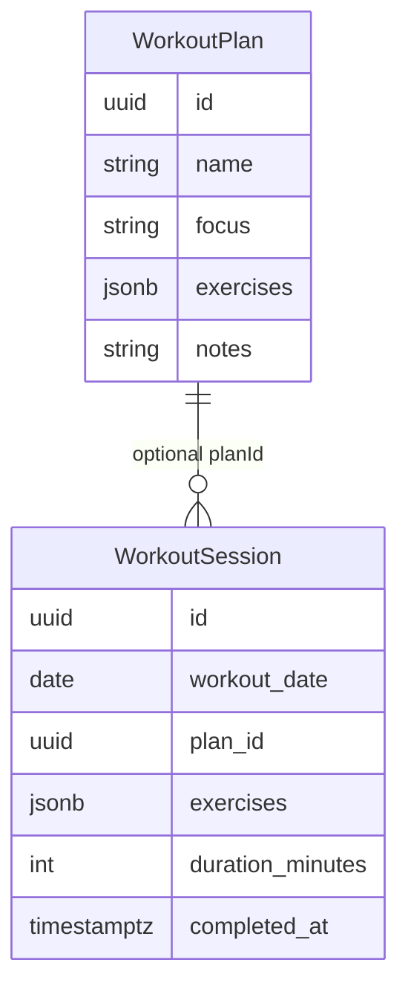
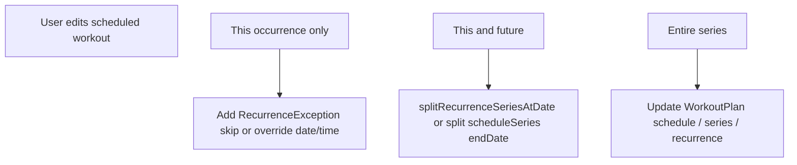
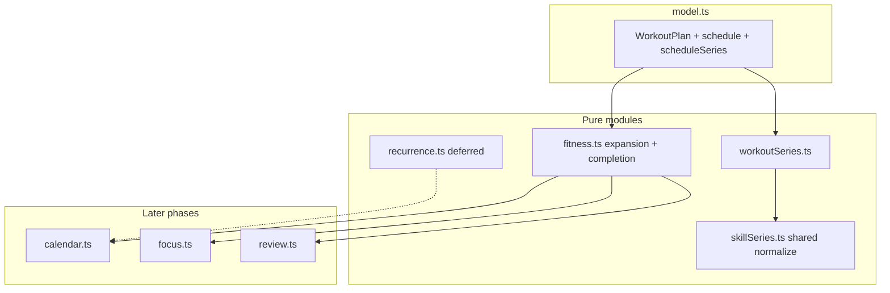

# Phase 27 — Workout Scheduling Foundation

**Deliverable (on approval):** write this document to [`docs/plans/phase-27-workout-scheduling-foundation.md`](docs/plans/phase-27-workout-scheduling-foundation.md).

**Scope of Phase 27:** design + pure-helper contracts only (mirrors Phase 23 for skills). **No migrations, no UI, no `calendar.ts` wiring, no implementation.**

Aligns with [`PROJECT_RULES.md`](PROJECT_RULES.md) (small phases, reuse patterns, backward compatibility) and [`SECURITY_RULES.md`](SECURITY_RULES.md) (validate untrusted JSON at mapper boundaries; no secrets in docs).

Roadmap context: [`docs/plans/roadmap.md`](docs/plans/roadmap.md) phases 27–30; this plan freezes the design before 28 (persistence) and 29 (UI).

---

## Executive summary

| Question | Recommendation |
|----------|----------------|
| Scheduling model | **Hybrid C — skill-primary:** `WeeklySchedule` + optional `scheduleSeries` on `WorkoutPlan`; optional future `recurrence` for non-weekly patterns |
| Calendar | **Virtual occurrences** expanded at read time (like skills/events); new `workoutScheduleBlock` meta; keep `workoutSession` for completed history |
| Completion | **Same local calendar day + `planId` match**; timed drift ignored in v1 |
| Phase 27 output | Types contract, new pure module `workoutSeries.ts` spec, tests matrix, architecture doc section — **no DB** |

---

## 1. Current workout data model

### What exists today



**[`WorkoutPlan`](src/core/model.ts)** — template only: `name`, `focus?`, `exercises[]`, `notes?`, timestamps. No schedule, no recurrence, no series linkage.

**[`WorkoutSession`](src/core/model.ts)** — **actual** logged workout: `date` (`YYYY-MM-DD`), optional `planId`, exercises, optional `durationMinutes`, optional `completedAtIso` (set when logging). Sessions are the only fitness signal for review/focus/briefing today.

**Database** ([`20260527400000_fitness.sql`](supabase/migrations/20260527400000_fitness.sql), [`20260527410000_fitness_session_metadata.sql`](supabase/migrations/20260527410000_fitness_session_metadata.sql)): plans and sessions tables only; no schedule columns.

**[`fitness.ts`](src/core/fitness.ts):** search/sort, `buildWorkoutWeekSummary`, `createSessionDraftFromPlan`, `copyExercisesFromPlan` — all assume plans are **ad-hoc templates**, not scheduled entities.

**[`dashboardStats.ts`](src/core/dashboardStats.ts):** no workout references (skills only).

**[`review.ts`](src/core/review.ts):** `buildFitnessWeekSection` uses `buildWorkoutWeekSummary(workoutSessions)` — **logged sessions only**; no planned vs missed workouts.

**[`briefing.ts`](src/core/briefing.ts) / [`focus.ts`](src/core/focus.ts):** fitness signals are reactive (no session this week, long gap, “log from first plan”). `schedule_workout` action exists but only navigates to fitness — **no real schedule**.

**[`calendar.ts`](src/core/calendar.ts):** fitness items = **completed** sessions with `completedAtIso` only (`collectFitnessItems`, `includeFitnessHistory` opt-in). No scheduled workout blocks.

### What must change (by layer)

| Layer | Change |
|-------|--------|
| **Model** | Add `schedule: WeeklySchedule` + optional `scheduleSeries` (+ future `recurrence?`, `seriesId?`) on `WorkoutPlan` |
| **Pure** | New [`workoutSeries.ts`](src/core/workoutSeries.ts) (active dates, range intersection, labels, cleanup) — parallel to [`skillSeries.ts`](src/core/skillSeries.ts) |
| **Fitness helpers** | `isPlanSchedulable`, `expandWorkoutOccurrencesForDate`, completion matchers, week planned-vs-done stats |
| **Mappers / DB** | Phase 28: `schedule jsonb`, `schedule_series jsonb` on `workout_plans` |
| **Calendar** | Phase 30: `collectWorkoutScheduleItems` + new `sourceMeta` variant |
| **Dashboard** | Phases 30+: focus/briefing/review/timeline consume **planned** occurrences |
| **UI** | Phase 29: schedule editor on Fitness plan form |

**`WorkoutSession`:** minimal changes for foundation — optional `scheduledDateKey?` / `scheduledBlockId?` deferred until timed completion or series-edit needs explicit linkage.

---

## 2. Scheduling model comparison

### Option A — Skill-style (`scheduleSeries` + `WeeklySchedule`)

| Pros | Cons |
|------|------|
| Proven in repo (Phases 23–25); same mental model as “Mon/Wed 6am Push” | No biweekly/monthly/custom interval without extra layer |
| `isSkillActiveOnDate` / `getSkillSeriesDateRange` reusable | “One-time on arbitrary date” needs `single_day` + block on that weekday |
| Simple persistence (jsonb schedule + schedule_series) | Not identical to event UX users may expect for “every 2 weeks” |

### Option B — Event-style (`RecurrenceRule` only)

| Pros | Cons |
|------|------|
| Full engine in [`recurrence.ts`](src/core/recurrence.ts); calendar expansion exists | Awkward for **multiple weekday blocks** (e.g. Mon Push + Fri Pull as one plan) |
| `splitRecurrenceSeriesAtDate`, exceptions, `seriesId` ready for Phase 33 | Heavier UI (Phase 26 event recurrence fields) |
| One-time = anchor only | Duplicates skill weekly template concept |

### Option C — Hybrid (recommended)

**Layer 1 — Weekly template (skill-parity):** `WorkoutPlan.schedule: WeeklySchedule` — which weekdays/times/durations apply.

**Layer 2 — Series bounds (skill-parity):** `WorkoutPlan.scheduleSeries?: ScheduleSeriesBounds` — reuse the **same shape** as `SkillScheduleSeries` (`indefinite` | `date_range` | `single_day`). Consider renaming in `model.ts` to shared `ScheduleSeriesBounds` with type aliases `SkillScheduleSeries` / `WorkoutScheduleSeries` for clarity without duplicating validators.

**Layer 3 — Advanced recurrence (deferred):** optional `WorkoutPlan.recurrence?: RecurrenceRule` when pattern exceeds weekly template (biweekly, monthly, yearly). Expand via `expandRecurrenceInstances` **only for dates that also pass** weekly template OR replace weekly template when `recurrence` is set (design choice in Phase 30 — recommend **recurrence overrides weekly** when present to avoid double expansion).

**Legacy rule (match skills):** omitted `scheduleSeries` = indefinite availability; omitted/empty `schedule` = **not schedulable** (template-only plan, today’s behavior).

### Mapping user-facing modes

| User intent | Model |
|-------------|--------|
| One-time workout | `scheduleSeries: { mode: "single_day", singleDate }` + block on that weekday (or `recurrence` anchor-only in future) |
| Recurring (weekly) | Blocks on weekdays + `scheduleSeries` omitted or `{ mode: "indefinite" }` |
| Indefinite program | Same as recurring + no end date |
| Date-range program | `scheduleSeries: { mode: "date_range", startDate, endDate }` |

---

## 3. Calendar integration strategy

### Principle: virtual occurrences, not stored rows

Do **not** materialize future `WorkoutSession` rows for upcoming workouts. Follow the skill/event pattern:

- **Skills:** weekday template × active dates → `skillScheduleBlock` items
- **Events:** `recurrence` expansion → `lifeEvent` items per date
- **Workouts (new):** weekday template × active dates × plan → **`workoutScheduleBlock`** items

### `CalendarItem` shape (Phase 30)

Extend [`CalendarItemSourceMeta`](src/core/calendar.ts):

```typescript
| {
    kind: "workoutScheduleBlock";
    planId: string;
    blockId: string;
    planName: string;
    focus?: WorkoutFocus;
    plannedMinutes: number;
    occurrenceDate: string; // YYYY-MM-DD
  }
```

Stable ID: `fitness:plan:{planId}:{blockId}:{date}` (mirror `skill:{skillId}:{blockId}:{date}`).

**Title:** plan name (or `formatWorkoutFocus` + plan name). **Subcategory:** `scheduled` (vs session history using focus as subcategory today).

**Timed blocks:** `startTime` / `endTime` from `ScheduleBlock` + `addMinutesToHHMM`.

### Coexistence with completed sessions

| Item kind | When shown | `subcategoryKey` |
|-----------|------------|------------------|
| Scheduled block | Plan schedulable + active on date + block on weekday | `scheduled` |
| Completed session | `completedAtIso` set (existing) | `focus` or `completed` |

Same day may show **both** scheduled block and completed session until UI merges visually (Phase 32+). Phase 30: show both; optional `completionStatus` in meta later.

### `buildCalendarItemsForRange` options

Add `includeWorkoutSchedules?: boolean` (default false until Phase 30). Keep `includeFitnessHistory` for logged sessions.

**Use [`recurrence.ts`](src/core/recurrence.ts):** only when `WorkoutPlan.recurrence` is added (Phase 30+). Phase 27–29: weekly expansion only via `iterateDateRange` + `weekdayFromDateString` (same as `collectSkillItems`).

### Filtering and colors

- **Category:** existing `fitness` ([`calendarColors.ts`](src/core/calendarColors.ts) default green).
- **Subcategory prefs:** `fitness:scheduled` vs `fitness:push` etc.
- **Aliases:** user alias on `fitness` applies to both; optional subcategory alias “Planned workouts” in preferences phase.

---

## 4. Completion model

### Scenario

> Scheduled: Mon 6:00 Push. Actual: Mon 7:15 Push.

### Recommendation (v1)

| Rule | Detail |
|------|--------|
| **Primary match** | `session.planId === plan.id` AND `session.date === occurrenceDate` |
| **Time tolerance** | **None for completion semantics** — calendar day is the unit of accountability (matches skill session logging and `buildWorkoutWeekSummary`) |
| **Display** | Calendar may still show actual start from `completedAtIso` on the session item |
| **Ambiguity** | Multiple sessions same plan same day: first chronologically completes occurrence; extras count toward volume but not additional “missed” slots |
| **No planId** | Session counts for weekly summary / wins; does **not** clear a specific scheduled block |
| **Missed** | Active date + block + no matching session by end of local day (consumer defines “end of day”; focus uses `todayKey`) |

### Optional Phase 30+ enhancements (document only)

- `scheduledBlockId` on `WorkoutSession` for explicit linkage after “Start from plan”
- Soft time window (e.g. ±12h from `startTime`) for “on-time” badge only, not completion
- `RecurrenceException` skip marks occurrence cancelled without session

### Pure helpers (Phase 27A spec)

- `matchSessionToScheduledOccurrence(session, plan, dateKey, blockId?)`
- `isWorkoutOccurrenceComplete(plan, dateKey, blockId, sessions)`
- `buildWorkoutDayStatus(plan, dateKey, sessions)` → `planned` | `completed` | `missed` | `not_scheduled`

---

## 5. Recurring workout editing (design only — Phase 33+)

Mirror event/skill split flows:



| Scope | Mechanism |
|-------|-----------|
| **This occurrence** | `recurrence.exceptions` skip/override **or** one-off exception table later; for weekly-only, store `planScheduleExceptions[]` `{ date, kind: skip \| overrideBlock }` |
| **This and future** | If using `recurrence`: `splitRecurrenceSeriesAtDate`; if skill-style only: set `scheduleSeries.endDate` on old plan, clone plan with new `startDate` + new `seriesId` |
| **Entire series** | Update `WorkoutPlan` fields in place |

**`seriesId`:** add optional `seriesId?: string` on `WorkoutPlan` in Phase 28 (nullable uuid column) for grouping splits — same as [`LifeEvent.seriesId`](src/core/model.ts).

**Do not implement in Phase 27–30** except reserving fields and documenting exception shape.

---

## 6. Dashboard implications

### Daily Focus ([`focus.ts`](src/core/focus.ts))

**Today:** `collectFitnessFocusItems` — no workouts this week, long gap, generic “log plan”.

**After scheduling:**

| Signal | Condition |
|--------|-----------|
| `fitness_workout_scheduled_today` | Plan has block today, no matching session |
| `fitness_workout_missed_yesterday` | Had block yesterday, no session (optional, lower priority) |
| Deprecate/lowercase | Generic `fitness_log_from_plan` when a **specific** scheduled plan exists |

Use stable IDs: `fitness:scheduled:{planId}:{dateKey}` for feedback suppression.

### Daily Briefing ([`briefing.ts`](src/core/briefing.ts))

Mention scheduled workouts in opener/context: “Push at 6:00 AM today” when timed block exists. Keep template-based copy; add `plannedWorkoutsToday` to briefing context struct.

### Weekly Review ([`review.ts`](src/core/review.ts))

Extend `FitnessWeekSection`:

| Metric | Source |
|--------|--------|
| `scheduledCount` | Expanded occurrences in week |
| `completedCount` | Sessions matching planned |
| `adherenceRate` | completed / scheduled (null if scheduled === 0) |

Wins/risks: win for adherence ≥ threshold; risk for missed scheduled days (parallel `scheduledDays` on skills).

**Important:** logged-only metrics remain for users with **no schedules** (backward compatible).

### Fitness summary section

[`FitnessSummarySection`](src/components/dashboard/FitnessSummarySection.tsx): add “Scheduled today” line when Phase 30 lands.

### Unified timeline

[`timeline.ts`](src/core/timeline.ts) has no fitness today. Phase 30+: optional `generateWorkoutScheduleItems` merged into today timeline for conflicts with skill blocks.

---

## 7. Future Outlook-style calendar

Consumes existing [`CalendarPage`](src/pages/CalendarPage.tsx) + [`calendarView.ts`](src/core/calendarView.ts) — **no view changes in Phase 27**.

| Surface | Workout scheduling fit |
|---------|-------------------------|
| **Month view** | Pills for `workoutScheduleBlock`; completed sessions may duplicate or merge in Phase 32 |
| **Week view** | Timed blocks positioned via `computeTimedItemLayout`; default duration from `ScheduleBlock.minutes` |
| **Color system** | `categoryKey: fitness`, `subcategoryKey: scheduled` → prefs `fitness:scheduled` |
| **Filtering** | `CalendarCategorySidebar` already toggles `fitness` — hides both scheduled and history |
| **Category aliases** | `resolveCategoryLabel` — e.g. alias “Body” for fitness |
| **Detail modal** | Read-only: plan name, focus, exercises summary, completion status; Phase 34+ edit actions |

**Dashboard 7-day preview:** [`CalendarPreviewSection`](src/components/dashboard/CalendarPreviewSection.tsx) passes `includeWorkoutSchedules: true` when integrated.

---

## 8. Phased implementation path

### Phase 27 — Foundation (this document)

- Freeze hybrid model and completion rules
- Spec [`workoutSeries.ts`](src/core/workoutSeries.ts) API (can share normalizer with `skillSeries` via internal `normalizeScheduleSeries`)
- Spec test matrix (20+ cases, mirroring [`skillSeries.test.ts`](src/core/skillSeries.test.ts))
- Update [`docs/architecture.md`](docs/architecture.md) “Workout schedule series” subsection
- **No schema, no UI**

### Phase 27A — Pure model + helpers

- Extend `WorkoutPlan` in [`model.ts`](src/core/model.ts)
- Implement `workoutSeries.ts` + tests
- Extend [`fitness.ts`](src/core/fitness.ts) with occurrence expansion + completion helpers
- `cleanupInvalidWorkoutScheduleSeries` wired in [`storage.ts`](src/core/storage.ts) load path (mirror skills)

### Phase 28 — Persistence

- Migration: `workout_plans.schedule jsonb NOT NULL DEFAULT '{}'`, `schedule_series jsonb NULL`, optional `series_id uuid NULL`
- [`dbMappers.ts`](src/core/dbMappers.ts): `parseWeeklySchedule`, `parseSkillScheduleSeries` reuse, `assertValidWorkoutPlan`
- RLS unchanged (owner policies on existing table)

### Phase 29 — UI

- [`WorkoutPlanForm`](src/components/fitness/WorkoutPlanForm.tsx) + `workoutScheduleFormState.ts` (mirror [`skillScheduleFormState.ts`](src/components/skills/skillScheduleFormState.ts) + weekday block editor from skills)
- [`App.tsx`](src/App.tsx) add/update plan clears `scheduleSeries` on indefinite
- Cards show `formatWorkoutScheduleSeriesLabel`

### Phase 30 — Calendar integration

- `calendar.ts` collectors + tests
- `CalendarPage` / preview flags
- Focus/briefing/review consume planned occurrences

### Phase 31+ — Polish

- Roadmap Phase 33 series editing
- Phase 34 drag/drop
- Optional `recurrence` on plans for non-weekly patterns

---

## Module layout (Phase 27A target)



---

## Security and validation

- All new jsonb fields parsed through [`dbMappers.ts`](src/core/dbMappers.ts) with allowlisted keys (same as `parseSkillScheduleSeries` / `parseWeeklySchedule`)
- SQL CHECK: `jsonb_typeof(schedule) = 'object'`, `schedule_series IS NULL OR jsonb_typeof = 'object'`
- Fail-closed: invalid `scheduleSeries` stripped on load; invalid schedule → empty schedule (not schedulable)
- No PII in schedule fields; exercise names already user content

---

## Recommended design (final)

1. **Skill-primary hybrid** on `WorkoutPlan`: `WeeklySchedule` + optional `ScheduleSeriesBounds` (shared type with skills).
2. **Virtual calendar occurrences** via new `workoutScheduleBlock` meta; keep session history separate.
3. **Day-level completion** via `planId` + `date` match.
4. **Defer** `RecurrenceRule`, `seriesId` splits, and exception UI to Phases 28–33.
5. **Backward compatibility:** plans without schedule blocks behave exactly as today.

---

## Risks

| Risk | Mitigation |
|------|------------|
| Duplicating skill/event logic | Shared `normalizeScheduleSeries`; single expansion path in `fitness.ts` |
| Calendar clutter (scheduled + completed) | Subcategory styling; merge UI later |
| Users expect biweekly/monthly on day one | Document as Phase 30+ `recurrence`; UI copy “weekly schedule” |
| Focus noise if every plan has blocks | Only surface **today’s** scheduled plans; cap items |
| Sync/migration breaks old plans | Default `schedule: {}`; empty = not schedulable |
| Multiple sessions one day | Document first-match completion rule |

---

## Migration path (data)

1. Deploy Phase 28 columns with defaults — existing rows unchanged.
2. Load path strips invalid series.
3. No backfill required — users opt in by adding schedule in UI.
4. Optional future: one-time import “suggest schedule from last 4 weeks of sessions” (analytics phase, not 27).

---

## Estimated implementation phases

| Phase | Effort (relative) | Deliverable |
|-------|-------------------|-------------|
| 27 | S | This architecture doc + architecture.md section |
| 27A | M | Pure types, `workoutSeries.ts`, fitness expansion tests |
| 28 | M | DB + mappers + sync |
| 29 | L | Fitness UI schedule editor |
| 30 | L | Calendar + dashboard consumers |
| 33 | L | Series edit / exceptions |

---

## Test plan (Phase 27A+)

- `workoutSeries.test.ts`: modes, invalid json, legacy omitted series, date lexicographic edges
- `fitness.test.ts`: occurrence expansion, completion/missed, empty schedule
- `calendar.test.ts` (Phase 30): stable IDs, range intersection, inactive series
- `focus.test.ts` / `review.test.ts` (Phase 30): scheduled today, adherence, no regression for unscheduled users

---

## Out of scope (explicit)

- Migrations and SQL (Phase 28)
- Fitness/Calendar UI (Phases 29–30)
- Notifications, AI, drag-and-drop
- Materialized occurrence tables
- Changing `WorkoutSession` schema beyond optional future linkage fields
