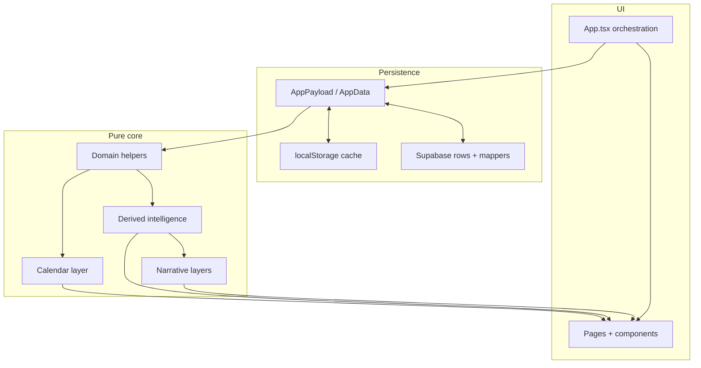

# Personal Assistant — Living Roadmap

This document tracks **what is done**, **how the system is layered**, and **what to build next**. It is the single place to orient future work without re-reading every phase plan.

**Related docs**

- [Architecture](../architecture.md) — layers, data flow, domain boundaries
- [Setup](../setup.md) — local dev and environment variables
- [Security](../security.md) — client/server boundaries and validation
- [PROJECT_RULES.md](../../PROJECT_RULES.md) — code quality, testing, workflow
- [SECURITY_RULES.md](../../SECURITY_RULES.md) — secrets, input validation, logging
- [Vercel + Supabase auth/storage plan](./vercel-supabase-auth-storage.md) — early infra phases
- [Aether Theme System plan](./aether-theme-system.md) — theme token contract, adoption track, UI development rule
- [Aether Theme Modes & Effects plan](./aether-theme-modes-and-effects.md) — Phase 37C (theme modes) / 37D (global effects) / 37E (cloud sync) detail and ordering

**Phase plans** (historical detail) live under [`.cursor/plans/`](../../.cursor/plans/) and [`docs/plans/`](./). Update this roadmap when a phase ships; link new plan files there when created.

---

## 1. Project vision

Personal Assistant is a **personal operating system**: one place to see how you spend time, who matters, what you owe yourself this week, and what deserves attention today. The app is a client-side React SPA with optional Supabase sync—not a generic task manager, but a **deterministic life dashboard** that can later add AI on top of stable derived layers.

Core domains and experiences:

| Area | Role |
|------|------|
| **Skills** | Weekly schedule blocks, goals, logged minutes, XP/streaks, optional schedule-series bounds |
| **Events** | Life events (timed, all-day, recurring) with optional people links |
| **People** | Contacts, birthdays, follow-up cadence, preferences |
| **Career** | Job applications pipeline, dream-job target, skill-gap awareness |
| **Fitness** | Workout plans (templates) and completed workout sessions |
| **Daily Focus** | Ranked cross-domain recommendations (not persisted; actionable CTAs) |
| **Daily Briefing** | Deterministic narrative summary of the day (not persisted) |
| **Weekly Review** | Monday–Sunday cross-domain recap (not persisted) |
| **Calendar** | Unified `CalendarItem` view (month/week), category filters, occurrence editing, week-view drag reschedule (`CalendarPage`) |
| **Recurrence** | Pure expansion engine + event recurrence persistence + Events UI |
| **Aether Theme** | Token-based fantasy-futuristic UI (`--aether-*` CSS variables, Aether Profiles, Settings Appearance) — see [Aether Theme System Roadmap](#4-aether-theme-system-roadmap) |
| **Future AI planning** | Optional summaries, suggestions, and agentic schedule help—**only after** deterministic systems are stable (see [rules](#6-rules-for-future-phases)) |

Long-term direction: calendar-centered planning (including expanded drag/editing), scheduled workouts, gamification, reminders, analytics, then AI insight and agentic planning—without breaking backward compatibility for stored payloads.

---

## 2. Completed phases

Short summaries of shipped work. Phase numbers match historical plan names where they exist.

| Phase | Name | Summary |
|-------|------|---------|
| — | **Skills / dashboard foundation** | Auth gate, Supabase RLS/sync, `AppPayload` model, skills/sessions CRUD, dashboard stats, app split into pages/components, dashboard visual system (Today hero, timeline, progress). |
| 8 | **Events** | Life events domain, Events page CRUD, upcoming-events dashboard widget; later timed/all-day support. |
| 11 | **People** | `Person` records, People page, birthdays/follow-ups on dashboard, `personId` on events. |
| 12 | **Career** | Job applications, career target singleton, Career page, pipeline/follow-up helpers, dashboard career section. |
| 13 | **Fitness** | Workout plans and sessions, Fitness page, plan→session copy, dashboard fitness summary; calendar can show completed sessions as history. |
| 14 | **Daily Focus** | `buildDailyFocusSummary` — ranked cross-domain `FocusItem`s with action types and expiry; dashboard section with CTAs. |
| 15 | **Daily Briefing** | `buildDailyBriefing` — deterministic NL greeting, workload, risks, tone; no AI APIs. |
| 16 | **Focus feedback** | Persisted dismiss/snooze suppression by `focusItemId`; hidden review drawer; briefing still uses unsuppressed focus. |
| 17 | **Weekly Review** | `buildWeeklyReview` for local calendar week; dashboard preview + Review page. |
| 18 | **Calendar foundation** | `buildCalendarItemsForRange`, `CalendarItem` DTO, sorting/grouping; skills, events, people birthdays, optional fitness history. |
| 19 | **Calendar colors** | Pure palette, `resolveCalendarItemColor`, category/subcategory defaults, usage index (no persistence). |
| 20 | **Calendar preferences persistence** | `AppPayload.calendarPreferences` + Supabase `calendar_preferences` table; validated mappers. |
| 21 | **Calendar UI foundation** | `CalendarPage` month/week views, toolbar, category sidebar, detail modal, dashboard 7-day preview. |
| 22A | **Recurrence foundation** | Pure `recurrence.ts` — expand rules, exceptions, series split helper, summaries (engine only). |
| 22B | **Recurring events persistence** | `LifeEvent.recurrence` + DB columns; calendar expands recurring events to per-date items. |
| 23 | **Skill schedule series foundation** | `SkillScheduleSeries` model + DB `schedule_series`; active-date helpers (pure). |
| 24 | **Skill schedule series integration** | Calendar, timeline, dashboard stats, review, focus/briefing respect active skill dates. |
| 25 | **Skill schedule series UI** | Skills page schedule availability (indefinite / date range / single day). |
| 26 | **Event recurrence UI** | Events form recurrence fields; create/edit recurring events; card labels via `formatRecurrenceSummary`. |
| 27–30 | **Workout scheduling** | Schedulable `WorkoutPlan` weekday blocks + bounds; calendar `workoutScheduleBlock` items; focus/briefing/review/dashboard consume scheduled workouts. |
| 31 | **Calendar color settings UI** | Collapsible settings on `CalendarPage` to edit category/subcategory colors + aliases; `setCalendarPreferences` commit path; live "used by" labels. |
| 32 | **Dashboard calendar centerpiece** | Desktop-first three-column dashboard (left do-now rail / center read-only calendar widget / right briefing rail) + mobile stack; shared `useCalendarController`; persisted dashboard view mode; `CalendarPreviewSection` deprecated. |
| 33 | **Series editing (events)** | Entire-series and this-and-future split for recurring life events; `eventSeries.ts` + Events scope selector + interactive calendar detail modal; `seriesId` via existing columns. |
| 34A | **Occurrence editing (events)** | Skip/move/delete-from-date/detach-this-occurrence for recurring events via `eventOccurrences.ts`; calendar modal quick actions + Events **This occurrence only** scope; no schema changes. |
| 34B | **Calendar drag foundations** | Week-view pointer drag for one-time timed life events; `calendarDrag.ts` + `useCalendarItemDrag`; `rescheduleLifeEvent` in `App.tsx`; no new dependencies. |
| 35 | **Gamification / XP dashboard** | RPG-style progression (global / axis / per-skill levels, achievements, quests) on pure engines; `GamificationState` ack singleton; dashboard progression surfaces. |
| 36 | **Calendar drag expansion** | Month-view date drag, week-view resize (end edge), click empty month day → Events draft, and an ephemeral undo snackbar; extended pure `calendarDrag.ts` helpers; `moveLifeEventDate` / `resizeLifeEvent` / `openCalendarEventDraft` / `applyCalendarEventUndo` in `App.tsx`; dashboard calendar stays read-only; no schema or dependency changes. Recurring-occurrence drag (36.1) and skill/workout drag (36.2) deferred. |
| 37A | **Settings page foundation / Aether Profiles** | New Settings tab; dark fantasy-futuristic Settings UI (sidebar + Appearance section, others "Coming Soon"); six **Aether Profiles** (Azure default / Emerald / Violet / Crimson / Amber / Obsidian); accent intensity (Soft/Balanced/Vibrant); interface-effect toggles; live preview; future-systems cards. Pure token system `theme.ts` (CSS `--aether-*` variables) with tests; preferences persisted to **`localStorage`** (`pa.appearance.v1`, no Supabase migration); CSS variables applied globally on `:root` for gradual adoption while existing pages stay unchanged. No new dependencies, no AI/notification/account behavior. |
| 37B | **Aether theme adoption layer** | Migrated shared chrome, dashboard, calendar chrome, and domain pages from hardcoded colors to `var(--aether-*)` **accent-derived tokens** centrally in [`appStyles.ts`](../../src/ui/appStyles.ts) (plus a few inline dashboard/skills/events borders). Active nav, buttons, progress/XP bars, panel & section borders, level badges, form-field/list borders, and calendar today highlights now retint when the Aether Profile changes; the shared deep-navy base + text stay constant (so no dark-on-dark) and semantic colors (error/overdue red, on-track green, level-up/streak gold, current-time line) plus the user calendar palette are intentionally preserved. Literal `var()` fallbacks kept everywhere; `theme.test.ts` adds an adoption-token contract block. No redesigns, layout changes, schema changes, or new dependencies. |
| 37C | **Theme Modes (Light / Dark / System)** | True theme-mode axis orthogonal to Aether Profiles. Pure `theme.ts` gains `ThemeMode`, optional `themeMode` on `AppearancePreferences` (default `system`, backward compatible), `resolveEffectiveThemeMode`, mode-aware `LIGHT_BASE` / `DARK_BASE`, new mode-driven tokens/CSS vars (`--aether-surface`, `--aether-surface-raised`, `--aether-surface-sunken`, `--aether-border`, and now mode-dependent `--aether-bg` / `--aether-text` / `--aether-text-muted`); accent stays profile-derived and mode-independent. [`useAppearanceTheme`](../../src/ui/useAppearanceTheme.ts) subscribes to `prefers-color-scheme`, mirrors the base palette onto `body`, and sets `data-aether-mode`. [`appStyles.ts`](../../src/ui/appStyles.ts) surface/text/neutral-border colors migrated to the new tokens (literal fallbacks kept); semantic light-fill chips (briefing/review tones, focus urgency, status/streak/level-up) got fixed readable text for dark-mode legibility. Settings adds a Light/Dark/System segmented control. `theme.test.ts` adds a Phase 37C block (mode resolution, mode/accent orthogonality, surface/text flips, normalization, contrast sanity). No layout redesign, schema, or dependency changes; localStorage only (cloud sync is 37E). |

**Not yet shipped** (called out in architecture): global visual effects engine (Phase 37D), appearance cloud sync (Phase 37E), exception list editor on Events form, recurring-occurrence drag with scope picker (Phase 36.1), week click-drag create-selection, skill/workout schedule drag (Phase 36.2), notifications (Phase 38), analytics (Phase 39), AI layers (Phases 40–41).

---

## 3. Current architecture layers

See [architecture.md](../architecture.md) for full detail. Stack: **Vite + React + TypeScript**, **Supabase Auth + Postgres (RLS)**, **localStorage cache**, debounced cloud sync.

### Raw `AppPayload` data

- Canonical user state in [`src/core/model.ts`](../../src/core/model.ts): skills, sessions, overrides, events, people, job applications, career target, workout plans/sessions, focus feedback, optional `calendarPreferences`, etc.
- Loaded/saved via [`storage.ts`](../../src/core/storage.ts); normalized on import for backward compatibility.
- **Not** where XP, daily focus, briefing, or weekly review are stored—they are recomputed.

### Domain helpers

- Per-entity pure modules: [`schedule.ts`](../../src/core/schedule.ts), [`events.ts`](../../src/core/events.ts), [`people.ts`](../../src/core/people.ts), [`career.ts`](../../src/core/career.ts), [`fitness.ts`](../../src/core/fitness.ts), [`sessions.ts`](../../src/core/sessions.ts).
- Validation at boundaries; display/search/sort helpers; no React.

### Derived intelligence layers

- [`dashboardStats.ts`](../../src/core/dashboardStats.ts) — today/week minutes, skill day rows, timeline inputs.
- [`progression.ts`](../../src/core/progression.ts) — XP, levels, streaks from sessions (ephemeral).
- [`timeline.ts`](../../src/core/timeline.ts) — unified today schedule + events, conflicts/workload.
- [`focus.ts`](../../src/core/focus.ts) + [`focusFeedback.ts`](../../src/core/focusFeedback.ts) — recommendations vs suppression state.

### Calendar layer

- [`calendar.ts`](../../src/core/calendar.ts) — `CalendarItem[]` for a date range (skills, expanded events, birthdays, fitness history).
- [`calendarView.ts`](../../src/core/calendarView.ts) — month/week grids, layout, filters.
- [`calendarColors.ts`](../../src/core/calendarColors.ts) — color/label resolution from preferences + defaults.
- [`calendarDrag.ts`](../../src/core/calendarDrag.ts) — week-view drag snap/reschedule math (Phase 34B).
- [`recurrence.ts`](../../src/core/recurrence.ts) — rule expansion (events; reusable for fitness later).
- [`eventSeries.ts`](../../src/core/eventSeries.ts) — recurring life-event series splits (Phase 33).
- [`eventOccurrences.ts`](../../src/core/eventOccurrences.ts) — skip/move/truncate/detach occurrence helpers (Phase 34A).
- [`skillSeries.ts`](../../src/core/skillSeries.ts) — when a skill’s weekly template is active.

### Narrative / summary layers

- [`briefing.ts`](../../src/core/briefing.ts) — daily deterministic copy.
- [`review.ts`](../../src/core/review.ts) — weekly wins/risks/domain sections.
- All **read-only**, template-based, no external AI.

### UI pages and components

- [`App.tsx`](../../src/App.tsx) — sync lifecycle, `commit`, CRUD handlers, page routing only.
- [`src/pages/*`](../../src/pages/) — presentational; props in, callbacks out.
- [`src/components/*`](../../src/components/) — dashboard, calendar, domain forms/cards.
- [`AppShell`](../../src/components/layout/AppShell.tsx) — nav (Dashboard, Calendar, Skills, Events, People, Career, Fitness, Review, Settings).
- **Aether Theme** ([`theme.ts`](../../src/core/theme.ts), [`useAppearanceTheme.ts`](../../src/ui/useAppearanceTheme.ts)) — pure tokens + global `--aether-*` CSS variables; consumed by the Settings page and (since Phase 37B) by shared chrome/widgets/domain pages via accent tokens in [`appStyles.ts`](../../src/ui/appStyles.ts). Canonical plan: [aether-theme-system.md](./aether-theme-system.md).

### Supabase sync layer

- [`remoteStorage.ts`](../../src/core/remoteStorage.ts) — `initialSync`, debounced `replaceRemotePayload`.
- [`dbMappers.ts`](../../src/core/dbMappers.ts) — row ↔ payload, strict parse for untrusted JSON.
- RLS-scoped tables per domain; anon key on client only ([`SECURITY_RULES.md`](../../SECURITY_RULES.md)).

---

## 4. Aether Theme System Roadmap

First-class track for the fantasy-futuristic visual layer. Full token contract, adoption order, and development rule: **[aether-theme-system.md](./aether-theme-system.md)**. Modes + effects + cloud-sync detail and ordering: **[aether-theme-modes-and-effects.md](./aether-theme-modes-and-effects.md)**.

| Phase | Status | Summary |
|-------|--------|---------|
| **37A** | ✅ Shipped | Settings foundation — Aether Profiles, intensity, interface effects, live preview, pure `theme.ts`, global `--aether-*` on `:root`, `localStorage` (`pa.appearance.v1`). Settings + preview are theme-aware; **most app pages still use hardcoded colors in `appStyles.ts`**. |
| **37B** | ✅ Shipped | **Theme Adoption Layer** — migrated app shell, nav, dashboard, calendar chrome, domain pages, progress bars, buttons, borders, and status indicators to `var(--aether-*)` accent tokens centrally in `appStyles.ts`. No redesigns or layout changes. **Deliverable met:** selecting a profile (Azure/Emerald/Violet/Crimson/Amber/Obsidian) retints the shared chrome across the app. |
| **37C** | ✅ Shipped | **Theme Modes (Light / Dark / System)** — true mode axis orthogonal to Aether Profiles; the deep-navy Settings aesthetic is the reference Dark Mode; mode-aware base palette + new surface/text/border tokens; `appStyles.ts` migrated to mode tokens; `prefers-color-scheme` subscription + `data-aether-mode`; Settings Light/Dark/System control. **Deliverable met:** `Azure + Light`, `Azure + Dark`, `Emerald + Light`, … render correctly app-wide; System follows the OS. |
| **37D** | Planned (next) | **Global Visual Effects** — promote the four effects (Ambient Particles, Animated Borders, Magical Energy Trails, Floating Runes) from Settings-local code into one centralized engine mounted once in `App.tsx`; pure `themeEffects.ts` resolver; performance tiers; mobile degradation; reduced-motion ready; no duplicated implementations. **Deliverable:** effects render app-wide, configurable globally. |
| **37E** | Planned | **Appearance Cloud Sync** — `appearance_preferences` Supabase singleton; sync profile, intensity, **mode**, **effects**, **performance**; local fallback + backward compatibility for existing localStorage users. **Deliverable:** theme follows the account across devices. (Previously numbered 37C; moved after modes + effects so the synced preference shape is finalized first.) |

### Phase 37A — Settings Page Foundation ✅ (shipped)

- Settings tab; Appearance section active; other categories **Coming Soon**
- Six Aether Profiles (Azure default, Emerald, Violet, Crimson, Amber, Obsidian)
- Accent intensity (Soft / Balanced / Vibrant); interface effect toggles; live preview
- [`theme.ts`](../../src/core/theme.ts) + [`theme.test.ts`](../../src/core/theme.test.ts); [`useAppearanceTheme`](../../src/ui/useAppearanceTheme.ts)

### Phase 37B — Theme Adoption Layer · ✅ Shipped

**Goal:** Migrate the application from hardcoded colors to Aether theme tokens.

**Scope (delivered):** App shell · navigation · dashboard widgets · calendar widgets · Skills · Events · People · Career · Fitness · Review · progress bars · buttons · borders · status indicators · calendar today/chrome (not user palette swatches).

**Approach:** centralized in [`appStyles.ts`](../../src/ui/appStyles.ts) — the shared style registry consumed by every page/component. Because the deep-navy base background + text are shared across all six profiles, only the **accent-derived tokens** (`--aether-accent`, `--aether-accent-soft`, `--aether-panel-border`, `--aether-progress-gradient`) were adopted, keeping the legible light base (no dark-on-dark) while making profile switches visibly recolor chrome app-wide. Literal `var()` fallbacks retained throughout.

**Requirements honored:** No redesigns · no layout changes · theme tokens only · backward compatibility · no schema or dependency changes · semantic + calendar-palette colors preserved.

**Deliverable met:** Selecting an Aether Profile visibly changes the appearance across the Dashboard and core chrome.

### Phase 37C — Theme Modes (Light / Dark / System) · ✅ Shipped

**Goal:** Add a true theme-mode axis orthogonal to Aether Profiles. The current Settings deep-navy aesthetic becomes the reference **Dark Mode**; today's app look becomes **Light Mode**; **System** follows `prefers-color-scheme`. Aether Profiles keep controlling **accent** independently of mode.

**Delivered:** `ThemeMode` type + optional `themeMode` on `AppearancePreferences` (default `system`, backward compatible via `normalizeAppearancePreferences`) · pure `resolveEffectiveThemeMode(mode, systemPrefersDark)` · mode-aware base palette (`LIGHT_BASE` / `DARK_BASE`) selected by `resolveThemeTokens(prefs, resolvedMode?)` · new mode-driven tokens + CSS vars (`--aether-surface`, `--aether-surface-raised`, `--aether-surface-sunken`, `--aether-border`, and now mode-dependent `--aether-bg` / `--aether-text` / `--aether-text-muted`) · surface/text/neutral-border migration in [`appStyles.ts`](../../src/ui/appStyles.ts) (literal `var()` fallbacks kept; semantic light-fill chips given fixed readable text) · [`useAppearanceTheme`](../../src/ui/useAppearanceTheme.ts) subscribes to `prefers-color-scheme` (via `useMediaQuery`), mirrors the base palette onto `body`, sets `data-aether-mode`, and exposes `resolvedMode` + `setThemeMode` · Settings Light/Dark/System segmented control ([`ThemeModeControl`](../../src/components/settings/ThemeModeControl.tsx)) · `theme.test.ts` Phase 37C block.

**Constraints honored:** Pure tokens first · tests before UI · `App.tsx` orchestration-only (controller already wired) · accent stays mode-independent · semantic colors + calendar palette preserved · literal `var()` fallbacks · backward compatible · no new dependencies.

**Deliverable met:** `Azure + Light` / `Azure + Dark` / `Emerald + Light` / … all render correctly app-wide; mode is selectable and persisted locally (`pa.appearance.v1`). Settings page remains its own deep-navy surface (the Dark Mode reference); re-theming Settings to follow Light Mode is out of scope.

### Phase 37D — Global Visual Effects · Planned

**Goal:** Centralize the four interface effects into one engine mounted once, configurable globally, performance-aware, mobile-graceful, and reduced-motion ready.

**Scope:** new pure `themeEffects.ts` (`resolveEffectSettings`) + tests · move keyframes/particle/rune data out of `SettingsPage` into `src/components/effects/` (`GlobalEffectStyles`, `AetherEffectsLayer`, reusable runes for dashboard widgets) · implement **Magical Energy Trails** (new) as centralized page-transition + press micro-interactions · optional `effectPerformance` and `reducedMotion` preference fields (backward compatible) · mobile density scaling via `useIsDesktopViewport` · mount once in `App.tsx` (orchestration only).

**Constraints:** No duplicated implementations · centralized + globally configurable · respects performance settings · degrades on mobile · honors `prefers-reduced-motion` (and reserves explicit reduced-motion shape) · no new dependencies.

**Deliverable:** Ambient particles, animated borders, energy trails, and floating runes render consistently app-wide from a single pure resolver.

### Phase 37E — Appearance Cloud Sync · Planned

**Goal:** Synchronize the complete appearance preferences across devices.

**Scope:** `appearance_preferences` Supabase singleton (mirror `calendar_preferences` / `gamification_state`) · sync profile / intensity / **mode** / **effects** / **performance** · `dbMappers` strict `parseAppearancePreferences` · `remoteStorage` fetch + debounced upsert · local fallback (`pa.appearance.v1`) · backward compatibility with localStorage-only users · documented last-write-wins / first-upload conflict policy.

**Deliverable:** User theme preferences follow the account across devices. (Sequenced last so the synced preference shape is finalized after modes + effects.)

---

## 5. Product roadmap

Ordered backlog after the Aether adoption track (or in parallel where UI is new — see [theme development rule](#6-rules-for-future-phases)). Create a plan under `.cursor/plans/` or `docs/plans/` before large work.

### Deferred calendar slices

| Slice | Summary |
|-------|---------|
| **36.1** | Recurring-occurrence drag + scope picker (this occurrence / this and future / entire series) |
| **36.2** | Skill/workout schedule drag (requires per-date override design) |

### Phase 38 — Notifications & Reminders · Planned

**Goal:** Introduce proactive assistant behavior.

**Examples:** Event reminders · birthday reminders · workout reminders · skill reminders · weekly review reminders.

**Settings integration:** Notifications category becomes functional (currently **Coming Soon**).

**Requirements:** Browser permission UX · privacy-safe logging · respect user toggles.

### Phase 39 — Analytics & Trends · Planned

**Goal:** Historical insight dashboards.

**Examples:** Skill trends · workout consistency · XP progression · goal completion rates · career pipeline trends.

**Approach:** Pure aggregation helpers first + read-only charts/tables; new UI must use Aether tokens.

### Phase 40 — AI Insight Layer · Planned

**Goal:** Generate observations from user behavior.

**Examples:** Missed habits · schedule patterns · workout consistency insights · relationship maintenance suggestions · productivity recommendations.

**Constraint:** Consume stable derived DTOs (`DailyFocusSummary`, `WeeklyReview`, calendar range)—not raw DB rows. No AI until deterministic layers are trustworthy.

### Phase 41 — Agentic Planning Layer · Planned

**Goal:** Allow the assistant to proactively build plans and recommendations.

**Examples:** Weekly planning suggestions · schedule optimization · focus recommendations · goal prioritization.

**Constraint:** Human-in-the-loop approval; no silent writes to `AppPayload`.

---

## 6. Rules for future phases

Aligned with [PROJECT_RULES.md](../../PROJECT_RULES.md) and [SECURITY_RULES.md](../../SECURITY_RULES.md).

1. **Prefer pure helpers first** — Add or extend `src/core/*` with tests before UI or schema.
2. **Add tests before UI complexity** — Especially recurrence, calendar expansion, and schedule bounds.
3. **Avoid schema changes until needed** — Design in a plan; migrate only when the model is stable.
4. **Keep `App.tsx` orchestration-only** — Sync, `commit`, CRUD handlers, page state; no large embedded UI.
5. **Keep UI presentational** — Pages/components receive data + callbacks; no direct `saveAppData` / Supabase calls.
6. **Preserve backward compatibility** — `normalizePayload` and lenient import for missing fields; optional new fields default to “off.”
7. **Avoid editing multiple domains in one phase** unless the feature truly requires it (e.g. calendar integration touching one new source type).
8. **Do not add AI until deterministic systems are stable** — Focus, briefing, review, calendar, and scheduling must be trustworthy without LLMs first.
9. **Validate untrusted input** — DB JSON, backups, and imports go through `dbMappers` parsers ([architecture](../architecture.md)).
10. **Document behavior changes** — Update `architecture.md` and this roadmap when a phase ships.
11. **Theme-aware UI (mandatory after Phase 37A)** — Any new UI component must consume Aether theme tokens (`var(--aether-*)` or `resolveThemeTokens`) instead of introducing new hardcoded colors, unless there is a **documented exception** in [aether-theme-system.md](./aether-theme-system.md).

---

## 7. Current next action

**Recommended next phase: [Phase 37D — Global Visual Effects](#phase-37d--global-visual-effects--planned)** — Phase 37C (Theme Modes) shipped, so the base palette is now mode-aware. Next, promote the four interface effects from Settings-local code into one centralized engine mounted once in `App.tsx` (pure `themeEffects.ts` resolver, performance tiers, mobile degradation, reduced-motion ready). Then **[Phase 37E — Appearance Cloud Sync](#phase-37e--appearance-cloud-sync--planned)**. Full detail and ordering rationale: [aether-theme-modes-and-effects.md](./aether-theme-modes-and-effects.md).

**Ordering note:** cloud sync moved from 37C to **37E** so the synced `AppearancePreferences` shape (now including `themeMode`, `effects`, and `effectPerformance`) is finalized before it is committed to a Supabase table + strict parser — avoiding a second migration.

**Parallel / later:** Phase 38 (Notifications) after Settings Notifications category has a home. Optional 37B follow-ups: tokenize remaining semantic status colors and tint native header action buttons if desired.

**Deferred calendar (36.1):** Before recurring-occurrence drag, design the scope picker reusing `EventSeriesEditScope` and Phase 34A helpers; require explicit scope confirmation before commit.

---

*Last updated: 2026-05-31 — Phase 37C (Theme Modes: Light/Dark/System) shipped: mode-aware base palette + new surface/text/border tokens, `appStyles.ts` migrated, `prefers-color-scheme` + `data-aether-mode`, Settings mode control; accent stays profile-derived. Next: 37D (Global Visual Effects) → 37E (Appearance Cloud Sync). Detail in [aether-theme-modes-and-effects.md](./aether-theme-modes-and-effects.md). Product phases 38–41 unchanged.*
