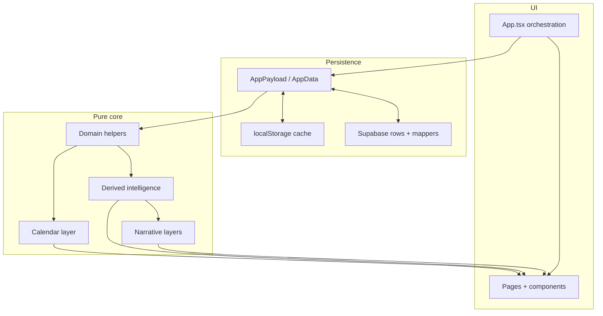

# Personal Assistant — Living Roadmap

This document tracks **what is done**, **how the system is layered**, and **what to build next**. It is the single place to orient future work without re-reading every phase plan.

**Related docs**

- [Architecture](../architecture.md) — layers, data flow, domain boundaries
- [Setup](../setup.md) — local dev and environment variables
- [Security](../security.md) — client/server boundaries and validation
- [PROJECT_RULES.md](../../PROJECT_RULES.md) — code quality, testing, workflow
- [SECURITY_RULES.md](../../SECURITY_RULES.md) — secrets, input validation, logging
- [Vercel + Supabase auth/storage plan](./vercel-supabase-auth-storage.md) — early infra phases

**Phase plans** (historical detail) live under [`.cursor/plans/`](../../.cursor/plans/). Update this roadmap when a phase ships; link new plan files there when created.

---

## 1. Project vision

Personal Assistant is a **personal operating system**: one place to see how you spend time, who matters, what you owe yourself this week, and what deserves attention today. The app is a client-side React SPA with optional Supabase sync—not a generic task manager, but a **deterministic life dashboard** that can later add AI on top of stable derived layers.

Core domains and experiences:

| Area | Role |
|------|------|
| **Skills** | Weekly schedule blocks, goals, logged minutes, XP/streaks, optional schedule-series bounds |
| **Events** | Life events (timed, all-day, recurring) with optional people links |
| **People** | Contacts, birthdays, follow-up cadence, preferences |
| **Career** | Job applications pipeline, dream-job target, skill-gap awareness |
| **Fitness** | Workout plans (templates) and completed workout sessions |
| **Daily Focus** | Ranked cross-domain recommendations (not persisted; actionable CTAs) |
| **Daily Briefing** | Deterministic narrative summary of the day (not persisted) |
| **Weekly Review** | Monday–Sunday cross-domain recap (not persisted) |
| **Calendar** | Unified `CalendarItem` view (month/week), category filters, occurrence editing, week-view drag reschedule (`CalendarPage`) |
| **Recurrence** | Pure expansion engine + event recurrence persistence + Events UI |
| **Future AI planning** | Optional summaries, suggestions, and agentic schedule help—**only after** deterministic systems are stable (see [rules](#6-rules-for-future-phases)) |

Long-term direction: calendar-centered planning (including expanded drag/editing), scheduled workouts, gamification, reminders, analytics, then AI insight and agentic planning—without breaking backward compatibility for stored payloads.

---

## 2. Completed phases

Short summaries of shipped work. Phase numbers match historical plan names where they exist.

| Phase | Name | Summary |
|-------|------|---------|
| — | **Skills / dashboard foundation** | Auth gate, Supabase RLS/sync, `AppPayload` model, skills/sessions CRUD, dashboard stats, app split into pages/components, dashboard visual system (Today hero, timeline, progress). |
| 8 | **Events** | Life events domain, Events page CRUD, upcoming-events dashboard widget; later timed/all-day support. |
| 11 | **People** | `Person` records, People page, birthdays/follow-ups on dashboard, `personId` on events. |
| 12 | **Career** | Job applications, career target singleton, Career page, pipeline/follow-up helpers, dashboard career section. |
| 13 | **Fitness** | Workout plans and sessions, Fitness page, plan→session copy, dashboard fitness summary; calendar can show completed sessions as history. |
| 14 | **Daily Focus** | `buildDailyFocusSummary` — ranked cross-domain `FocusItem`s with action types and expiry; dashboard section with CTAs. |
| 15 | **Daily Briefing** | `buildDailyBriefing` — deterministic NL greeting, workload, risks, tone; no AI APIs. |
| 16 | **Focus feedback** | Persisted dismiss/snooze suppression by `focusItemId`; hidden review drawer; briefing still uses unsuppressed focus. |
| 17 | **Weekly Review** | `buildWeeklyReview` for local calendar week; dashboard preview + Review page. |
| 18 | **Calendar foundation** | `buildCalendarItemsForRange`, `CalendarItem` DTO, sorting/grouping; skills, events, people birthdays, optional fitness history. |
| 19 | **Calendar colors** | Pure palette, `resolveCalendarItemColor`, category/subcategory defaults, usage index (no persistence). |
| 20 | **Calendar preferences persistence** | `AppPayload.calendarPreferences` + Supabase `calendar_preferences` table; validated mappers. |
| 21 | **Calendar UI foundation** | `CalendarPage` month/week views, toolbar, category sidebar, detail modal, dashboard 7-day preview. |
| 22A | **Recurrence foundation** | Pure `recurrence.ts` — expand rules, exceptions, series split helper, summaries (engine only). |
| 22B | **Recurring events persistence** | `LifeEvent.recurrence` + DB columns; calendar expands recurring events to per-date items. |
| 23 | **Skill schedule series foundation** | `SkillScheduleSeries` model + DB `schedule_series`; active-date helpers (pure). |
| 24 | **Skill schedule series integration** | Calendar, timeline, dashboard stats, review, focus/briefing respect active skill dates. |
| 25 | **Skill schedule series UI** | Skills page schedule availability (indefinite / date range / single day). |
| 26 | **Event recurrence UI** | Events form recurrence fields; create/edit recurring events; card labels via `formatRecurrenceSummary`. |
| 27–30 | **Workout scheduling** | Schedulable `WorkoutPlan` weekday blocks + bounds; calendar `workoutScheduleBlock` items; focus/briefing/review/dashboard consume scheduled workouts. |
| 31 | **Calendar color settings UI** | Collapsible settings on `CalendarPage` to edit category/subcategory colors + aliases; `setCalendarPreferences` commit path; live "used by" labels. |
| 32 | **Dashboard calendar centerpiece** | Desktop-first three-column dashboard (left do-now rail / center read-only calendar widget / right briefing rail) + mobile stack; shared `useCalendarController`; persisted dashboard view mode; `CalendarPreviewSection` deprecated. |
| 33 | **Series editing (events)** | Entire-series and this-and-future split for recurring life events; `eventSeries.ts` + Events scope selector + interactive calendar detail modal; `seriesId` via existing columns. |
| 34A | **Occurrence editing (events)** | Skip/move/delete-from-date/detach-this-occurrence for recurring events via `eventOccurrences.ts`; calendar modal quick actions + Events **This occurrence only** scope; no schema changes. |
| 34B | **Calendar drag foundations** | Week-view pointer drag for one-time timed life events; `calendarDrag.ts` + `useCalendarItemDrag`; `rescheduleLifeEvent` in `App.tsx`; no new dependencies. |
| 35 | **Gamification / XP dashboard** | RPG-style progression (global / axis / per-skill levels, achievements, quests) on pure engines; `GamificationState` ack singleton; dashboard progression surfaces. |
| 36 | **Calendar drag expansion** | Month-view date drag, week-view resize (end edge), click empty month day → Events draft, and an ephemeral undo snackbar; extended pure `calendarDrag.ts` helpers; `moveLifeEventDate` / `resizeLifeEvent` / `openCalendarEventDraft` / `applyCalendarEventUndo` in `App.tsx`; dashboard calendar stays read-only; no schema or dependency changes. Recurring-occurrence drag (36.1) and skill/workout drag (36.2) deferred. |

**Not yet shipped** (called out in architecture): exception list editor on Events form, recurring-occurrence drag with scope picker (Phase 36.1), week click-drag create-selection, skill/workout schedule drag (Phase 36.2), dashboard customization, notifications, analytics, AI layers.

---

## 3. Current architecture layers

See [architecture.md](../architecture.md) for full detail. Stack: **Vite + React + TypeScript**, **Supabase Auth + Postgres (RLS)**, **localStorage cache**, debounced cloud sync.

### Raw `AppPayload` data

- Canonical user state in [`src/core/model.ts`](../../src/core/model.ts): skills, sessions, overrides, events, people, job applications, career target, workout plans/sessions, focus feedback, optional `calendarPreferences`, etc.
- Loaded/saved via [`storage.ts`](../../src/core/storage.ts); normalized on import for backward compatibility.
- **Not** where XP, daily focus, briefing, or weekly review are stored—they are recomputed.

### Domain helpers

- Per-entity pure modules: [`schedule.ts`](../../src/core/schedule.ts), [`events.ts`](../../src/core/events.ts), [`people.ts`](../../src/core/people.ts), [`career.ts`](../../src/core/career.ts), [`fitness.ts`](../../src/core/fitness.ts), [`sessions.ts`](../../src/core/sessions.ts).
- Validation at boundaries; display/search/sort helpers; no React.

### Derived intelligence layers

- [`dashboardStats.ts`](../../src/core/dashboardStats.ts) — today/week minutes, skill day rows, timeline inputs.
- [`progression.ts`](../../src/core/progression.ts) — XP, levels, streaks from sessions (ephemeral).
- [`timeline.ts`](../../src/core/timeline.ts) — unified today schedule + events, conflicts/workload.
- [`focus.ts`](../../src/core/focus.ts) + [`focusFeedback.ts`](../../src/core/focusFeedback.ts) — recommendations vs suppression state.

### Calendar layer

- [`calendar.ts`](../../src/core/calendar.ts) — `CalendarItem[]` for a date range (skills, expanded events, birthdays, fitness history).
- [`calendarView.ts`](../../src/core/calendarView.ts) — month/week grids, layout, filters.
- [`calendarColors.ts`](../../src/core/calendarColors.ts) — color/label resolution from preferences + defaults.
- [`calendarDrag.ts`](../../src/core/calendarDrag.ts) — week-view drag snap/reschedule math (Phase 34B).
- [`recurrence.ts`](../../src/core/recurrence.ts) — rule expansion (events; reusable for fitness later).
- [`eventSeries.ts`](../../src/core/eventSeries.ts) — recurring life-event series splits (Phase 33).
- [`eventOccurrences.ts`](../../src/core/eventOccurrences.ts) — skip/move/truncate/detach occurrence helpers (Phase 34A).
- [`skillSeries.ts`](../../src/core/skillSeries.ts) — when a skill’s weekly template is active.

### Narrative / summary layers

- [`briefing.ts`](../../src/core/briefing.ts) — daily deterministic copy.
- [`review.ts`](../../src/core/review.ts) — weekly wins/risks/domain sections.
- All **read-only**, template-based, no external AI.

### UI pages and components

- [`App.tsx`](../../src/App.tsx) — sync lifecycle, `commit`, CRUD handlers, page routing only.
- [`src/pages/*`](../../src/pages/) — presentational; props in, callbacks out.
- [`src/components/*`](../../src/components/) — dashboard, calendar, domain forms/cards.
- [`AppShell`](../../src/components/layout/AppShell.tsx) — nav (Dashboard, Calendar, Skills, Events, People, Career, Fitness, Review).

### Supabase sync layer

- [`remoteStorage.ts`](../../src/core/remoteStorage.ts) — `initialSync`, debounced `replaceRemotePayload`.
- [`dbMappers.ts`](../../src/core/dbMappers.ts) — row ↔ payload, strict parse for untrusted JSON.
- RLS-scoped tables per domain; anon key on client only ([`SECURITY_RULES.md`](../../SECURITY_RULES.md)).

---

## 4. Recommended next phases

Ordered backlog. Each phase should stay **scoped** (one domain or one vertical slice). Create a plan under `.cursor/plans/` before large work.

### Phase 27–30 — Workout Scheduling ✅ (shipped)

- Schedulable `WorkoutPlan` weekday blocks + bounds; calendar `workoutScheduleBlock` items; focus/briefing/review/dashboard consume scheduled workouts.

### Phase 31 — Calendar Color Settings UI ✅ (shipped)

- Collapsible settings on `CalendarPage` to edit category/subcategory colors and display aliases.
- `setCalendarPreferences` through `App.tsx` `commit`; live “used by” labels from `buildColorUsageIndex`.

### Phase 32 — Dashboard Calendar Centerpiece ✅ (shipped)

- Calendar-centered dashboard: desktop-first three columns (left do-now rail / center read-only calendar widget / right briefing rail) with a stacked mobile fallback.
- Left rail: Daily Focus → category filters → quick actions. Right rail: briefing → upcoming → weekly review → career/fitness/people alerts.
- Shared `useCalendarController` between `CalendarPage` and `DashboardCalendarWidget`; persisted dashboard month/week view mode (localStorage, not synced).
- `ProgressionHero` left unchanged at the time (XP integration deferred to the gamification phase); replaced by `ProgressionPanel` in Phase 35. `CalendarPreviewSection` deprecated and slated for later removal.

### Phase 33 — Series Editing ✅ (shipped)

- **Entire series** and **this and future** edit scopes for recurring life events.
- Pure `splitEventSeriesAtDate` in `eventSeries.ts`; `updateEventSeries` in `App.tsx`; scope selector on Events edit form; calendar detail modal actions on `CalendarPage`.
- Shared `seriesId` on split halves; no schema changes.

### Phase 34A — Occurrence Editing ✅ (shipped)

- Skip, move, delete-this-and-future, and edit-this-occurrence-only for recurring life events.
- Pure `eventOccurrences.ts`; calendar modal quick actions; Events **This occurrence only** scope when opened from an occurrence.
- Edit-this-occurrence-only = skip on parent + new one-time event; exceptions persist via existing `recurrence.exceptions`.

### Phase 34B — Calendar Drag Foundations ✅ (shipped)

- Week view pointer drag for **one-time timed life events** only; native events (no new dependencies).
- Pure `calendarDrag.ts` + `useCalendarItemDrag`; `rescheduleLifeEvent` in `App.tsx`.

### Phase 35 — Gamification / XP Dashboard ✅ (shipped)

- RPG-style progression on top of existing domain data: global, five axis (Mind/Body/Career/Social/Creative), and per-skill levels.
- Pure engines first (`progressionContext`, `rewardCalculation`, `progressionEngine`, `achievementEngine`, `questEngine`, `progressionSnapshot`) with static `achievementCatalog` / `questCatalog` / `milestoneTables`; XP/levels/achievements/quests recomputed, only `GamificationState` acks persisted (`gamification_state` Supabase singleton).
- Bonus XP for goals, streak milestones, workouts, career actions, people follow-ups, and a v1 event-attendance proxy; per-day bonus cap and deterministic grant ids.
- Dashboard surfaces: `ProgressionPanel` (replaces `ProgressionHero`), `ProgressionAxisRow`, `ActiveQuestsCard`, `AchievementShowcase`, `LevelUpToast`; `App.tsx` adds `acknowledgeGlobalLevel` / `dismissAchievementNotification` and stays orchestration-only.
- Plan: [phase_35_gamification](../../.cursor/plans/phase_35_gamification_d85381a0.plan.md).

### Phase 36 — Drag-and-Drop Expansion ✅ (shipped)

- Month-view date drag for one-time life events (date only; preserves times), week-view resize of one-time timed events (end edge, grid-snapped, validated `end > start`), click empty month day → prefilled Events draft, and a lightweight ephemeral undo snackbar.
- Pure helpers in [`calendarDrag.ts`](../../src/core/calendarDrag.ts): `canDragCalendarItemInMonth`, `computeMonthDropTarget`, `canResizeCalendarItem`, `computeResizeTarget`, `buildEventDraftFromCalendarSelection`, `CalendarEventUndoPayload`. New hooks `useCalendarMonthItemDrag` / `useCalendarItemResize`; `CalendarUndoSnackbar`.
- `App.tsx` adds `moveLifeEventDate`, `resizeLifeEvent`, `openCalendarEventDraft`, `applyCalendarEventUndo` (returns undo payloads; stays orchestration-only). Dashboard calendar remains read-only.
- **Deferred:** recurring-occurrence drag + scope picker (Phase 36.1), week click-drag create-selection bands, skill/workout schedule drag (Phase 36.2).

### Phase 37 — Notifications / Reminders

- Browser reminders for events, birthdays, workouts, focus items.
- Respect user permission and privacy rules; no secret leakage in logs.

### Phase 38 — Analytics / Trends

- Skill minutes over time, workout duration by week, event load, career pipeline health, people follow-up health, focus feedback patterns.
- Prefer pure aggregation helpers + read-only charts/tables.

### Phase 39 — AI Insight Layer

- Optional AI summaries, priority suggestions, reflection prompts.
- Must consume stable derived DTOs (`DailyFocusSummary`, `WeeklyReview`, calendar range)—not raw DB rows.

### Phase 40 — Agentic Planning Layer

- AI proposes schedule changes, rebalancing, what to move/skip/prioritize.
- Human-in-the-loop approval; no silent writes to `AppPayload`.

---

## 5. Rules for future phases

Aligned with [PROJECT_RULES.md](../../PROJECT_RULES.md) and [SECURITY_RULES.md](../../SECURITY_RULES.md).

1. **Prefer pure helpers first** — Add or extend `src/core/*` with tests before UI or schema.
2. **Add tests before UI complexity** — Especially recurrence, calendar expansion, and schedule bounds.
3. **Avoid schema changes until needed** — Design in a plan; migrate only when the model is stable.
4. **Keep `App.tsx` orchestration-only** — Sync, `commit`, CRUD handlers, page state; no large embedded UI.
5. **Keep UI presentational** — Pages/components receive data + callbacks; no direct `saveAppData` / Supabase calls.
6. **Preserve backward compatibility** — `normalizePayload` and lenient import for missing fields; optional new fields default to “off.”
7. **Avoid editing multiple domains in one phase** unless the feature truly requires it (e.g. calendar integration touching one new source type).
8. **Do not add AI until deterministic systems are stable** — Focus, briefing, review, calendar, and scheduling must be trustworthy without LLMs first.
9. **Validate untrusted input** — DB JSON, backups, and imports go through `dbMappers` parsers ([architecture](../architecture.md)).
10. **Document behavior changes** — Update `architecture.md` and this roadmap when a phase ships.

---

## 6. Current next action

**Current recommended next phase: [Phase 37 — Notifications / Reminders](#phase-37--notifications--reminders)** (Phase 36 calendar drag expansion shipped).

Before the next drag slice (Phase 36.1 recurring-occurrence drag):

1. Design the scope picker (this occurrence / this and future / entire series) reusing `EventSeriesEditScope` and the Phase 34A occurrence helpers; require explicit scope confirmation before any commit to avoid accidental series mutation.
2. Keep mutations routed through `App.tsx` `commit`; skill/workout schedule blocks remain non-draggable (template-derived) until per-date overrides are designed (Phase 36.2).

---

*Last updated: 2026-05-31 — through Phase 36 (Calendar drag expansion: month drag, week resize, create draft, undo).*
