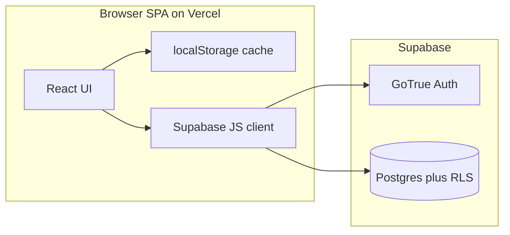

# Vercel + Supabase Auth + Postgres migration

This document is the approved plan for migrating the personal assistant app from localStorage-only storage to **Vercel** (hosting), **Supabase Auth** (email/password), and **Supabase Postgres** with **Row Level Security (RLS)**. App implementation follows this plan in small phases; this file does not contain secrets.

---

## Alignment with repo rules

- **[PROJECT_RULES.md](../../PROJECT_RULES.md)**: Small reviewable phases, strong typing, minimal dependencies (add only `@supabase/supabase-js` unless a later phase justifies more), no speculative abstractions, update setup/architecture docs when behavior changes.
- **[SECURITY_RULES.md](../../SECURITY_RULES.md)** and **[.cursor/rules/10-security-rules.mdc](../../.cursor/rules/10-security-rules.mdc)**: Never commit secrets, tokens, or real keys; `.env.example` lists **variable names only** (no values that resemble secrets); never expose server-only keys to client code; validate untrusted input (including imported JSON backups); do not log tokens, session payloads, or session identifiers.
- **Stack note**: [docs/architecture.md](../architecture.md) may still describe a different stack; update it when this migration ships so docs match the Vite + React app under `src/`.

---

## Schema decision: Option B (normalized) over Option A (document row)

**Chosen approach**: **Option B** — relational tables for `skills`, `sessions`, and `overrides`, with **weekly schedule stored as `jsonb` on `skills`** (no separate `schedule_blocks` table in the first implementation).

**Why Option B over Option A**

- **Option A** (`user_app_state` with a single large `payload` jsonb) minimizes migration effort and mirrors the current `AppPayload` blob, but couples all data to one row/versioning story and makes per-entity operations (e.g. inserting one session, partial failure recovery) heavier and less explicit in SQL.
- **Option B** keeps **skills**, **sessions**, and **overrides** as first-class rows with clear **`user_id`** ownership, which maps cleanly to **RLS per table**, future indexing, and incremental sync (debounced writes per entity type). It aligns with existing domain types in [src/core/model.ts](../../src/core/model.ts) while still avoiding a premature `schedule_blocks` split.
- **Schedule as jsonb on `skills`** preserves the current [WeeklySchedule](../../src/core/model.ts) shape (weekday → `ScheduleBlock[]`) without normalization overhead; a separate `schedule_blocks` table can be introduced later if reporting or constraints require it.

---

## Recommended architecture



- **Hosting**: Vercel serves the static Vite SPA. First phase: data access via Supabase client with the **anon** key; **RLS** enforces authorization (no custom backend required for CRUD).
- **Auth**: Supabase email/password only; session via `@supabase/supabase-js`. **2FA**: out of scope for v1; can be enabled later in the Supabase dashboard without schema changes.
- **Data ownership**: Every app table includes `user_id uuid NOT NULL REFERENCES auth.users(id) ON DELETE CASCADE`. The client only uses the authenticated user’s JWT; policies restrict rows to `auth.uid()`.
- **Transition**: **localStorage** remains a **cache / offline draft**; **JSON export/import** remains backup and migration path. Document a single **sync policy** (merge vs replace, timestamps) in code and here when implemented.

**Dependency**: `@supabase/supabase-js` only (unless a later phase adds justified tooling).

---

## Database schema (Option B, finalized)

UUID primary keys match client-generated IDs ([src/App.tsx](../../src/App.tsx) uses `crypto.randomUUID()`).

### `skills`

| Column | Type | Notes |
|--------|------|--------|
| `id` | uuid PK | Client-generated or server default |
| `user_id` | uuid NOT NULL | `REFERENCES auth.users(id) ON DELETE CASCADE` |
| `name` | text NOT NULL | |
| `priority` | smallint NULL | CHECK 1–4 when not null |
| `daily_goal_minutes` | int NULL | |
| `weekly_goal_minutes` | int NULL | |
| `schedule` | jsonb NOT NULL DEFAULT `'{}'::jsonb` | [WeeklySchedule](../../src/core/model.ts): weekday → `ScheduleBlock[]` |
| `created_at` | timestamptz NOT NULL | |
| `updated_at` | timestamptz NOT NULL | Maintain via trigger or app |

**Deferred**: splitting `schedule` into a `schedule_blocks` table.

### `sessions`

| Column | Type | Notes |
|--------|------|--------|
| `id` | uuid PK | |
| `user_id` | uuid NOT NULL | FK `auth.users`; aligns with RLS |
| `skill_id` | uuid NOT NULL | `REFERENCES skills(id) ON DELETE CASCADE` |
| `minutes` | int NOT NULL | CHECK `minutes > 0` |
| `started_at` | timestamptz NOT NULL | |
| `created_at` | timestamptz NOT NULL | |

### `overrides` (placeholder)

| Column | Type | Notes |
|--------|------|--------|
| `id` | uuid PK | |
| `user_id` | uuid NOT NULL | |
| `kind` | text NULL | Constrain later if needed |
| `payload` | jsonb NOT NULL DEFAULT `'{}'::jsonb` | Matches extensible `overrides` in app |
| `created_at` | timestamptz NOT NULL | |

### Indexes (minimal)

- `(user_id)` on `skills`, `sessions`, `overrides`.
- Optional: `(user_id, started_at DESC)` on `sessions` for dashboard queries.

---

## RLS policies (deny-by-default)

Enable RLS on **`skills`**, **`sessions`**, and **`overrides`**.

For each table, typical policies:

- **SELECT**: `user_id = auth.uid()`
- **INSERT**: `WITH CHECK (user_id = auth.uid())`
- **UPDATE**: `USING (user_id = auth.uid()) WITH CHECK (user_id = auth.uid())`
- **DELETE**: `USING (user_id = auth.uid())`

Ensure **`sessions.skill_id`** only references skills visible under RLS (FK + policies on `skills` prevent cross-user attachment in practice).

Use Supabase-appropriate **GRANT**s for the `authenticated` role; avoid public write access.

**Triggers**: e.g. `updated_at` on `skills` (implementation detail in migration SQL).

---

## Environment variables (Vercel and local dev)

Per [SECURITY_RULES.md](../../SECURITY_RULES.md), the repo **must not** contain real URLs or keys. [.env.example](../../.env.example) must list **only** these variable names with empty values (no other keys in this file for the Supabase SPA phase):

```env
VITE_SUPABASE_URL=
VITE_SUPABASE_ANON_KEY=
```

Remove legacy placeholders (e.g. `DATABASE_URL`, `AUTH_SECRET`) from `.env.example` unless a future server component reintroduces them with names-only policy.

The anon key is **public by design** in a browser SPA; **authorization is enforced by RLS**, not by hiding the anon key.

**Do not** add `SUPABASE_SERVICE_ROLE_KEY` to:

- `.env.example` (not required for this SPA phase),
- any `VITE_*` variable,
- or any client-side module (Vite bundle). Reserve service role for **server-only** automation (Edge Functions, CI scripts) if added in a future phase—and keep it out of git.

Configure **Supabase Auth** redirect URLs, site URL, and email confirmation behavior in the **Supabase Dashboard** (not in the repo).

**Vite `base`**: [vite.config.ts](../../vite.config.ts) uses a subpath; Supabase redirect URLs must match the deployed origin and path so auth completes.

---

## Files likely to change or add (implementation reference)

| Area | Paths |
|------|--------|
| Dependencies | [package.json](../../package.json), lockfile |
| Environment | [.env.example](../../.env.example), Vercel project settings |
| Supabase client | e.g. `src/lib/supabaseClient.ts` (reads `import.meta.env.VITE_*` only) |
| Auth UI | e.g. `src/auth/*` — sign up, sign in, sign out, `onAuthStateChange` |
| Persistence | [src/core/storage.ts](../../src/core/storage.ts) kept for local/export/import; new modules for remote CRUD/sync |
| App shell | [src/App.tsx](../../src/App.tsx) — session gate; consider splitting data provider vs pages in small steps |
| Types / mappers | [src/core/model.ts](../../src/core/model.ts) plus DB row ↔ domain mappers |
| SQL | `supabase/migrations/*.sql` or equivalent documented migrations |
| Docs | [docs/setup.md](../setup.md), [docs/architecture.md](../architecture.md) |

---

## Phased implementation plan (scoped)

**Phase 0 — Project setup**

- Create Supabase project; store URL and anon key in Vercel and local env files **outside** git (or only in platform secret UI).
- Schema decision: **this document (Option B)**.

**Phase 1 — Schema and RLS**

- Add migration SQL: tables, constraints, indexes, RLS, grants, `updated_at` trigger if used.
- Verify with two test users: user A cannot read or write user B’s rows.

**Phase 2 — Client wiring (minimal UX)**

- Add `@supabase/supabase-js`; typed `createClient`; dev-friendly error if `VITE_*` vars are missing.
- Optional: unit tests for payload ↔ row mappers (no network).

**Phase 3 — Auth (email/password)**

- Sign up, sign in, sign out; safe error messages (no token or password echo).
- Gate main app on valid session so only authenticated users reach synced data.

**Phase 4 — Dual mode: localStorage plus remote**

- Preserve [loadAppData / saveAppData / exportBackup / importBackup](../../src/core/storage.ts).
- After login: fetch remote → apply documented merge/replace → update cache.
- On mutations: update UI and localStorage; persist to Supabase with debouncing or explicit cloud save to limit requests.

**Phase 5 — Hardening**

- Loading and error UI; basic retry for transient failures.
- Consider namespacing localStorage by `user_id` on shared devices.
- Update setup and architecture docs.

**Phase 6 — Vercel**

- Set `VITE_SUPABASE_URL` and `VITE_SUPABASE_ANON_KEY` in Vercel; confirm SPA fallback and `base` URL alignment.
- Smoke-test auth and RLS in production.

---

## Risks and edge cases

- **Multi-device / offline conflicts**: pick and document one policy (e.g. last-write-wins per row using `updated_at`, or server wins on first load).
- **Email confirmation**: if enabled, users must confirm before sign-in works—document for operators.
- **Subpath and redirects**: misconfigured Supabase URLs break auth flows.
- **Imported backups**: size limits and schema validation; treat file contents as untrusted.
- **Rate limits**: rely on Supabase defaults initially.

---

## Validation checklist

- [ ] Sign-up, sign-in, sign-out; unauthenticated users cannot access synced data UI.
- [ ] RLS verified for two accounts.
- [ ] Refresh while logged in restores session and correct data.
- [ ] localStorage and export/import still work during transition.
- [ ] Build and typecheck pass; no `SERVICE_ROLE` or service role key in client source or `VITE_*`.
- [ ] `.env.example` contains only `VITE_SUPABASE_URL` and `VITE_SUPABASE_ANON_KEY` (names, empty values); no secrets in repo.

---

## Rollback strategy

- **Feature flag** (optional env): e.g. `VITE_ENABLE_REMOTE_SYNC=false` to force local-only behavior without reverting git history.
- **Vercel**: redeploy or roll back to a previous production deployment.
- **Database**: prefer forward-only migrations; use Supabase backups/PITR if available for disaster recovery.
- **User data**: encourage export before first cloud sync; keep export visible through the transition.

---

## Repo hygiene (secrets)

- This plan intentionally contains **no** API keys, JWTs, connection strings, or `SUPABASE_SERVICE_ROLE_KEY`.
- Implementation must not add service role keys to the Vite app, `.env.example`, or documentation examples.

### Apply `.env.example` in git

Ensure the root [.env.example](../../.env.example) file matches the [canonical two-line template](#environment-variables-vercel-and-local-dev) exactly (no legacy `DATABASE_URL` / `AUTH_SECRET` lines for this SPA phase unless you reintroduce them later with the same names-only rule). Commit that change with the plan if it is not already on disk.
